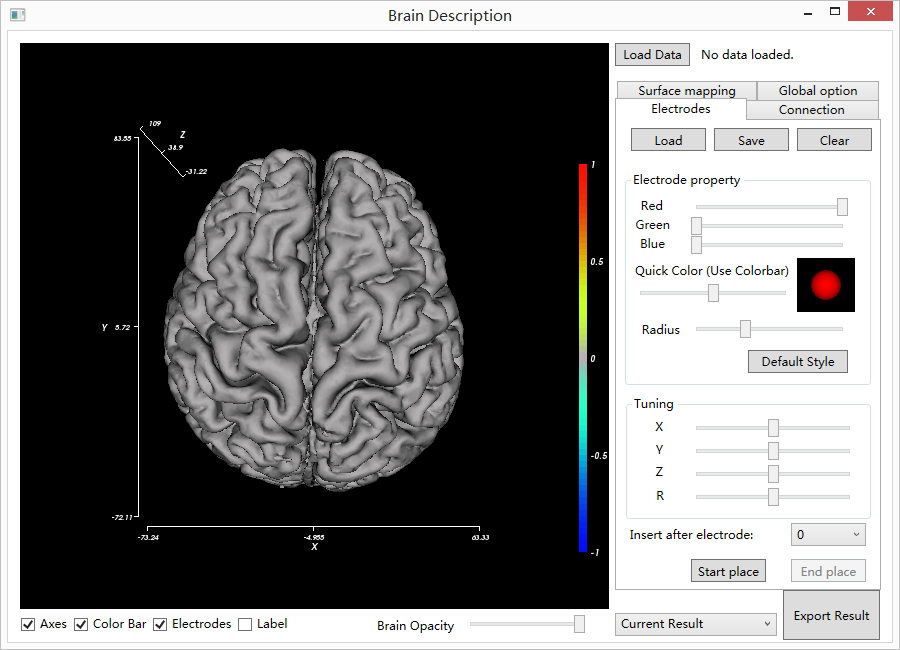

BrainFunctionMapping
====================

## Introduction

The brain function mapping tool is an assistant software for epilepsy surgeries.

It provides doctors with electrode registration and function parameter visualizaiton for pre-operative evaluation.

It can also be used for visualizing brain functional connectivity or activation maps in clinical studies.

## Features

It currently consists of the following functions:

1. Import and render brain model from file of vertices and triangle faces;
2. Mannual register electrodes,with options to change node size, color, and coordinate;
3. Visualize brain function parameters with maps or nodes, with options to change interpolation method, color map, or node properties;
4. Visualize brain functional connectivity with ball-and-stick model, with options to change interpolation method, color map, or node properties;
5. Save/load electrode coordinates;
6. Save function parameter visualizaiton settings;
7. Save functional connectivity visualizaiton settings;
8. Export screen as images (*.bmp)
9. Provide options to toggle display for nodes, links, color map, as well as changing the opacity of the brain model;
10. Provide options to fast change camera views, and save/load camera settings.

## Installation
Download the software [here](https://github.com/redyjq/BrainFunctionMapping/releases).

## Documentation
Read its document [here](http://wylmer_cn.gitbooks.io/brain-function-mapping-tool-document/content/).

## Notes
The changelog file provides detailed changes until its current release.
